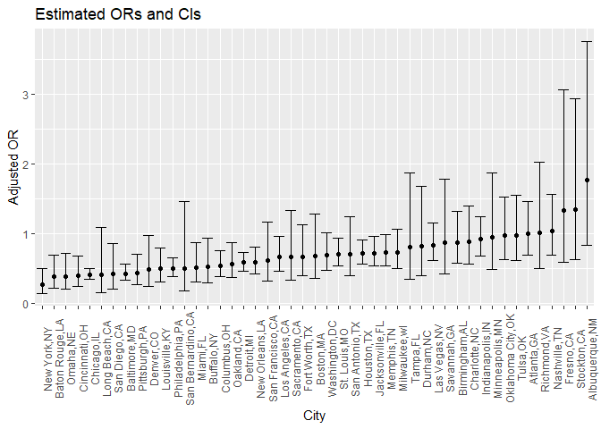
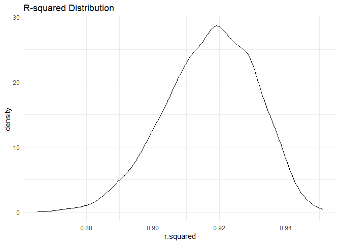
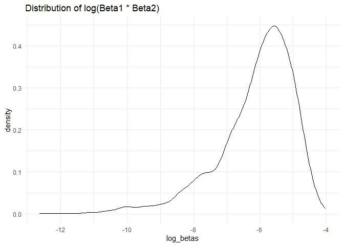
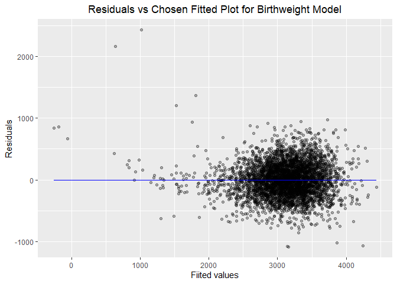
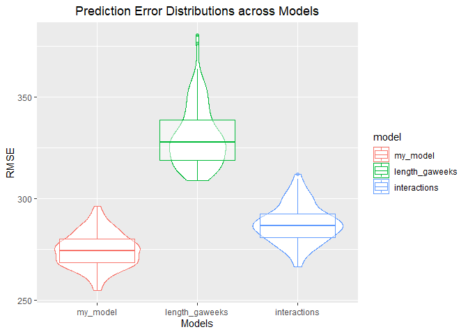

Homework6
================
Danny Nguyen
2023-11-29

# Question 1

``` r
homicide <- read_csv("homicide-data.csv") %>% 
  janitor::clean_names() %>% 
  mutate(
    city_state = str_c(city, state, sep = ","),
    victim_age = as.numeric(victim_age),
    victim_race = fct(victim_race),
    result = ifelse(disposition == "Closed by arrest", 1, 0)) %>% 
  group_by(city_state)%>% 
  filter(city_state != "Tulsa,AL" & city_state!= "Dallas,TX" & city_state != "Phoenix,AZ" & city_state!="Kansas City,MO")%>% 
  filter(victim_race == "White" | victim_race =="Black") %>%
  select(city_state, result, victim_age, victim_race, victim_sex)
```

    ## Rows: 52179 Columns: 12
    ## ── Column specification ────────────────────────────────────────────────────────
    ## Delimiter: ","
    ## chr (9): uid, victim_last, victim_first, victim_race, victim_age, victim_sex...
    ## dbl (3): reported_date, lat, lon
    ## 
    ## ℹ Use `spec()` to retrieve the full column specification for this data.
    ## ℹ Specify the column types or set `show_col_types = FALSE` to quiet this message.

    ## Warning: There was 1 warning in `mutate()`.
    ## ℹ In argument: `victim_age = as.numeric(victim_age)`.
    ## Caused by warning:
    ## ! NAs introduced by coercion

``` r
baltimore = homicide %>% 
  filter(city_state == "Baltimore,MD")%>% 
  glm(result ~ victim_age + victim_sex + victim_race, data = ., family =binomial())%>%
  broom::tidy() %>%
  mutate(
    OR = exp(estimate),
    lower_ci = exp(estimate - 1.96 * std.error),
    upper_ci = exp(estimate + 1.96 * std.error)
  ) %>% 
  select(term, estimate, OR, lower_ci,upper_ci ) %>% 
  knitr::kable(digits = 3)

baltimore
```

| term             | estimate |    OR | lower_ci | upper_ci |
|:-----------------|---------:|------:|---------:|---------:|
| (Intercept)      |    1.152 | 3.164 |    1.989 |    5.031 |
| victim_age       |   -0.007 | 0.993 |    0.987 |    1.000 |
| victim_sexMale   |   -0.854 | 0.426 |    0.325 |    0.558 |
| victim_raceBlack |   -0.842 | 0.431 |    0.306 |    0.607 |

``` r
OR = homicide %>% 
  nest(data = -city_state) %>% 
  mutate(
    regression = map(.x = data, ~glm(formula = result ~ victim_age + victim_sex + victim_race, data = .x, family = binomial())),
    results = map(regression, broom::tidy)
  ) %>% 
  select(-data, -regression) %>% 
  unnest(results) %>% 
  filter(term == "victim_sexMale") %>% 
  mutate(
    OR = exp(estimate),
    lower_ci = exp(estimate - 1.96 * std.error),
    upper_ci = exp(estimate + 1.96 * std.error)
  ) %>% 
  select(city_state,OR, lower_ci,upper_ci ) 

OR
```

    ## # A tibble: 47 × 4
    ## # Groups:   city_state [47]
    ##    city_state        OR lower_ci upper_ci
    ##    <chr>          <dbl>    <dbl>    <dbl>
    ##  1 Albuquerque,NM 1.77     0.831    3.76 
    ##  2 Atlanta,GA     1.00     0.684    1.46 
    ##  3 Baltimore,MD   0.426    0.325    0.558
    ##  4 Baton Rouge,LA 0.381    0.209    0.695
    ##  5 Birmingham,AL  0.870    0.574    1.32 
    ##  6 Boston,MA      0.674    0.356    1.28 
    ##  7 Buffalo,NY     0.521    0.290    0.935
    ##  8 Charlotte,NC   0.884    0.557    1.40 
    ##  9 Chicago,IL     0.410    0.336    0.501
    ## 10 Cincinnati,OH  0.400    0.236    0.677
    ## # … with 37 more rows

Comparing male victims to female victims, the adjusted OR is 0.426
suggesting that in Baltimore, MD, the odds of solving a homicide for
male victims are 0.426 times the the odds of solving a homicide for
female victims controlling for other factors. We are 95% confident that
this true OR lies between 0.325 and 0.558. The confidence interval does
not include 1 meaning that a statistically significant difference.

``` r
OR %>% 
  ggplot(aes(x = fct_reorder(city_state, OR), y = OR)) +
  geom_point() + 
  geom_errorbar(aes(ymin = lower_ci, ymax = upper_ci)) + 
  theme(axis.text.x = element_text(angle = 90))+
  labs(
    x = "City",
    y = "Adjusted OR",
    title = "Estimated ORs and CIs"
  )
```

<!-- -->

# Question 2

``` r
weather_df = 
  rnoaa::meteo_pull_monitors(
    c("USW00094728"),
    var = c("PRCP", "TMIN", "TMAX"), 
    date_min = "2022-01-01",
    date_max = "2022-12-31") |>
  mutate(
    name = recode(id, USW00094728 = "CentralPark_NY"),
    tmin = tmin / 10,
    tmax = tmax / 10) |>
  select(name, id, everything())
```

    ## using cached file: C:\Users\duong\AppData\Local/R/cache/R/rnoaa/noaa_ghcnd/USW00094728.dly

    ## date created (size, mb): 2023-10-30 21:30:56 (8.556)

    ## file min/max dates: 1869-01-01 / 2023-10-31

``` r
fit_model <- lm(tmax ~ tmin + prcp, data = weather_df)

set.seed(123456)

boot_sample = function(df) {
  sample_frac(df, replace = TRUE)
}

boot_straps = 
  data_frame(
    strap_number = 1:5000,
    strap_sample = rerun(5000, boot_sample(weather_df))
  )
```

    ## Warning: `data_frame()` was deprecated in tibble 1.1.0.
    ## ℹ Please use `tibble()` instead.
    ## This warning is displayed once every 8 hours.
    ## Call `lifecycle::last_lifecycle_warnings()` to see where this warning was
    ## generated.

    ## Warning: `rerun()` was deprecated in purrr 1.0.0.
    ## ℹ Please use `map()` instead.
    ##   # Previously
    ##   rerun(5000, boot_sample(weather_df))
    ## 
    ##   # Now
    ##   map(1:5000, ~ boot_sample(weather_df))
    ## This warning is displayed once every 8 hours.
    ## Call `lifecycle::last_lifecycle_warnings()` to see where this warning was
    ## generated.

``` r
bootstrap_results = 
  boot_straps %>% 
  mutate(
    models = map(strap_sample, ~lm(tmax ~ tmin + prcp, data = .x) ),
    results = map(models, broom::tidy)) %>% 
  select(-strap_sample, -models) %>% 
  unnest(results) 

log_betas <-  
  bootstrap_results %>%
  group_by(strap_number) %>%
  summarise(log_betas = log(estimate[2] * estimate[3])) %>%
  select(log_betas, strap_number)
```

    ## Warning: There were 3345 warnings in `summarise()`.
    ## The first warning was:
    ## ℹ In argument: `log_betas = log(estimate[2] * estimate[3])`.
    ## ℹ In group 2: `strap_number = 2`.
    ## Caused by warning in `log()`:
    ## ! NaNs produced
    ## ℹ Run ]8;;ide:run:dplyr::last_dplyr_warnings()dplyr::last_dplyr_warnings()]8;; to see the 3344 remaining warnings.

``` r
bootstrap_results2 <- 
  boot_straps %>% 
  mutate(
    models = map(strap_sample, ~lm(tmax ~ tmin + prcp, data = .x) ),
    results = map(models, broom::glance)) %>% 
  select(-strap_sample, -models) %>% 
  unnest(results) 

r_squared <- 
  bootstrap_results2 %>%
  select(r.squared, strap_number)
```

#### Fitting density plot of 2 estimates

``` r
ggplot(r_squared, aes(x = r.squared)) + 
  geom_density() +
  labs(title = "R-squared Distribution") +
  theme_minimal()
```

<!-- -->

``` r
ggplot(log_betas, aes(x = log_betas)) + 
  geom_density() +
  labs(title = "Distribution of log(Beta1 * Beta2)") +
  theme_minimal()
```

    ## Warning: Removed 3345 rows containing non-finite values (`stat_density()`).

<!-- -->

``` r
r_squared1 = r_squared %>%
  summarise(r_squared_sd = sd(r.squared), 
            r_squared_mean = mean(r.squared)) %>%
  pull(r_squared_sd, r_squared_mean)

log_betas1 = log_betas %>% 
  summarise(log_betas_sd = sd(as.numeric(log_betas),na.rm = TRUE),
           log_betas_mean = mean(as.numeric(log_betas), na.rm = TRUE) ) %>%
  pull(log_betas_sd, log_betas_mean) 
```

The r-squared values are normally distributed, as the mean of `0.917`
with SD of `0.0136`, meaning a consistent model fit across bootstrap
samples. Meanwhile, the distribution for log(B1\*B2) is left-skewed with
a mean of `-6.116` with SD of `1.164`.

``` r
CI_result <- log_betas %>%
  summarize(ci_lower = quantile(log_betas, 0.025, na.rm = TRUE),
            ci_upper = quantile(log_betas, 0.975, na.rm = TRUE))
```

The 95% CI is (-9.135264, -4.5661382)

# Question 3

``` r
birthweight <- read_csv("birthweight.csv")
```

    ## Rows: 4342 Columns: 20
    ## ── Column specification ────────────────────────────────────────────────────────
    ## Delimiter: ","
    ## dbl (20): babysex, bhead, blength, bwt, delwt, fincome, frace, gaweeks, malf...
    ## 
    ## ℹ Use `spec()` to retrieve the full column specification for this data.
    ## ℹ Specify the column types or set `show_col_types = FALSE` to quiet this message.

``` r
birthweight %>% 
  janitor::clean_names() %>% 
   mutate(babysex = ifelse(babysex == "1", "male","female"),
         malform = ifelse(malform == "0", "absent","present"),
         frace = recode(frace, "1" = "White", "2" = "Black", "3" = "Asian", 
                        "4" = "Puerto Rican", "8" = "Other", "9" = "Unknown"),
         mrace = recode(mrace, "1" = "White", "2" = "Black", 
                        "3" = "Asian", "4" = "Puerto Rican", "8" = "Other")) %>%
   mutate(babysex = as.factor(babysex),
    frace = as.factor(frace),
    malform = as.factor(malform),
    mrace = as.factor(mrace),
    parity = as.factor(parity),
    pnumlbw = as.factor(pnumlbw),
    pnumsga = as.factor(pnumsga))
```

    ## # A tibble: 4,342 × 20
    ##    babysex bhead blength   bwt delwt fincome frace gaweeks malform menarche
    ##    <fct>   <dbl>   <dbl> <dbl> <dbl>   <dbl> <fct>   <dbl> <fct>      <dbl>
    ##  1 female     34      51  3629   177      35 White    39.9 absent        13
    ##  2 male       34      48  3062   156      65 Black    25.9 absent        14
    ##  3 female     36      50  3345   148      85 White    39.9 absent        12
    ##  4 male       34      52  3062   157      55 White    40   absent        14
    ##  5 female     34      52  3374   156       5 White    41.6 absent        13
    ##  6 male       33      52  3374   129      55 White    40.7 absent        12
    ##  7 female     33      46  2523   126      96 Black    40.3 absent        14
    ##  8 female     33      49  2778   140       5 White    37.4 absent        12
    ##  9 male       36      52  3515   146      85 White    40.3 absent        11
    ## 10 male       33      50  3459   169      75 Black    40.7 absent        12
    ## # … with 4,332 more rows, and 10 more variables: mheight <dbl>, momage <dbl>,
    ## #   mrace <fct>, parity <fct>, pnumlbw <fct>, pnumsga <fct>, ppbmi <dbl>,
    ## #   ppwt <dbl>, smoken <dbl>, wtgain <dbl>

``` r
skimr::skim(birthweight)
```

|                                                  |             |
|:-------------------------------------------------|:------------|
| Name                                             | birthweight |
| Number of rows                                   | 4342        |
| Number of columns                                | 20          |
| \_\_\_\_\_\_\_\_\_\_\_\_\_\_\_\_\_\_\_\_\_\_\_   |             |
| Column type frequency:                           |             |
| numeric                                          | 20          |
| \_\_\_\_\_\_\_\_\_\_\_\_\_\_\_\_\_\_\_\_\_\_\_\_ |             |
| Group variables                                  | None        |

Data summary

**Variable type: numeric**

| skim_variable | n_missing | complete_rate |    mean |     sd |     p0 |     p25 |     p50 |     p75 |   p100 | hist  |
|:--------------|----------:|--------------:|--------:|-------:|-------:|--------:|--------:|--------:|-------:|:------|
| babysex       |         0 |             1 |    1.49 |   0.50 |   1.00 |    1.00 |    1.00 |    2.00 |    2.0 | ▇▁▁▁▇ |
| bhead         |         0 |             1 |   33.65 |   1.62 |  21.00 |   33.00 |   34.00 |   35.00 |   41.0 | ▁▁▆▇▁ |
| blength       |         0 |             1 |   49.75 |   2.72 |  20.00 |   48.00 |   50.00 |   51.00 |   63.0 | ▁▁▁▇▁ |
| bwt           |         0 |             1 | 3114.40 | 512.15 | 595.00 | 2807.00 | 3132.50 | 3459.00 | 4791.0 | ▁▁▇▇▁ |
| delwt         |         0 |             1 |  145.57 |  22.21 |  86.00 |  131.00 |  143.00 |  157.00 |  334.0 | ▅▇▁▁▁ |
| fincome       |         0 |             1 |   44.11 |  25.98 |   0.00 |   25.00 |   35.00 |   65.00 |   96.0 | ▃▇▅▂▃ |
| frace         |         0 |             1 |    1.66 |   0.85 |   1.00 |    1.00 |    2.00 |    2.00 |    8.0 | ▇▁▁▁▁ |
| gaweeks       |         0 |             1 |   39.43 |   3.15 |  17.70 |   38.30 |   39.90 |   41.10 |   51.3 | ▁▁▂▇▁ |
| malform       |         0 |             1 |    0.00 |   0.06 |   0.00 |    0.00 |    0.00 |    0.00 |    1.0 | ▇▁▁▁▁ |
| menarche      |         0 |             1 |   12.51 |   1.48 |   0.00 |   12.00 |   12.00 |   13.00 |   19.0 | ▁▁▂▇▁ |
| mheight       |         0 |             1 |   63.49 |   2.66 |  48.00 |   62.00 |   63.00 |   65.00 |   77.0 | ▁▁▇▂▁ |
| momage        |         0 |             1 |   20.30 |   3.88 |  12.00 |   18.00 |   20.00 |   22.00 |   44.0 | ▅▇▂▁▁ |
| mrace         |         0 |             1 |    1.63 |   0.77 |   1.00 |    1.00 |    2.00 |    2.00 |    4.0 | ▇▇▁▁▁ |
| parity        |         0 |             1 |    0.00 |   0.10 |   0.00 |    0.00 |    0.00 |    0.00 |    6.0 | ▇▁▁▁▁ |
| pnumlbw       |         0 |             1 |    0.00 |   0.00 |   0.00 |    0.00 |    0.00 |    0.00 |    0.0 | ▁▁▇▁▁ |
| pnumsga       |         0 |             1 |    0.00 |   0.00 |   0.00 |    0.00 |    0.00 |    0.00 |    0.0 | ▁▁▇▁▁ |
| ppbmi         |         0 |             1 |   21.57 |   3.18 |  13.07 |   19.53 |   21.03 |   22.91 |   46.1 | ▃▇▁▁▁ |
| ppwt          |         0 |             1 |  123.49 |  20.16 |  70.00 |  110.00 |  120.00 |  134.00 |  287.0 | ▅▇▁▁▁ |
| smoken        |         0 |             1 |    4.15 |   7.41 |   0.00 |    0.00 |    0.00 |    5.00 |   60.0 | ▇▁▁▁▁ |
| wtgain        |         0 |             1 |   22.08 |  10.94 | -46.00 |   15.00 |   22.00 |   28.00 |   89.0 | ▁▁▇▁▁ |

As We check the dataset and find that there are no missing data, then we
perform series of `mutate()` to get appropriate data types as well as
how they should be formatted for the regression analysis. The dataset
contains 4342 rows and 20 columns in total.

``` r
first_model = lm(bwt ~ ., data = birthweight)
summary(first_model)
```

    ## 
    ## Call:
    ## lm(formula = bwt ~ ., data = birthweight)
    ## 
    ## Residuals:
    ##      Min       1Q   Median       3Q      Max 
    ## -1081.29  -184.01    -4.34   174.29  2425.18 
    ## 
    ## Coefficients: (3 not defined because of singularities)
    ##               Estimate Std. Error t value Pr(>|t|)    
    ## (Intercept) -6201.9274   668.2669  -9.281  < 2e-16 ***
    ## babysex        32.3397     8.5490   3.783 0.000157 ***
    ## bhead         134.4216     3.4705  38.733  < 2e-16 ***
    ## blength        76.3778     2.0384  37.469  < 2e-16 ***
    ## delwt           3.9571     0.3989   9.921  < 2e-16 ***
    ## fincome         0.6543     0.1776   3.684 0.000232 ***
    ## frace          -5.8678     8.7969  -0.667 0.504788    
    ## gaweeks        12.0387     1.4809   8.129 5.59e-16 ***
    ## malform        14.2400    71.4190   0.199 0.841969    
    ## menarche       -4.2630     2.9242  -1.458 0.144957    
    ## mheight         4.7511    10.4062   0.457 0.648002    
    ## momage          3.4425     1.1930   2.886 0.003927 ** 
    ## mrace         -48.1943     9.9575  -4.840 1.34e-06 ***
    ## parity         89.8788    40.9290   2.196 0.028147 *  
    ## pnumlbw             NA         NA      NA       NA    
    ## pnumsga             NA         NA      NA       NA    
    ## ppbmi          -0.9683    15.0322  -0.064 0.948642    
    ## ppwt           -2.6603     2.6384  -1.008 0.313354    
    ## smoken         -3.7220     0.5819  -6.396 1.76e-10 ***
    ## wtgain              NA         NA      NA       NA    
    ## ---
    ## Signif. codes:  0 '***' 0.001 '**' 0.01 '*' 0.05 '.' 0.1 ' ' 1
    ## 
    ## Residual standard error: 275.5 on 4325 degrees of freedom
    ## Multiple R-squared:  0.7116, Adjusted R-squared:  0.7105 
    ## F-statistic:   667 on 16 and 4325 DF,  p-value: < 2.2e-16

``` r
step(first_model, direction = 'both')
```

    ## Start:  AIC=48810.15
    ## bwt ~ babysex + bhead + blength + delwt + fincome + frace + gaweeks + 
    ##     malform + menarche + mheight + momage + mrace + parity + 
    ##     pnumlbw + pnumsga + ppbmi + ppwt + smoken + wtgain
    ## 
    ## 
    ## Step:  AIC=48810.15
    ## bwt ~ babysex + bhead + blength + delwt + fincome + frace + gaweeks + 
    ##     malform + menarche + mheight + momage + mrace + parity + 
    ##     pnumlbw + pnumsga + ppbmi + ppwt + smoken
    ## 
    ## 
    ## Step:  AIC=48810.15
    ## bwt ~ babysex + bhead + blength + delwt + fincome + frace + gaweeks + 
    ##     malform + menarche + mheight + momage + mrace + parity + 
    ##     pnumlbw + ppbmi + ppwt + smoken
    ## 
    ## 
    ## Step:  AIC=48810.15
    ## bwt ~ babysex + bhead + blength + delwt + fincome + frace + gaweeks + 
    ##     malform + menarche + mheight + momage + mrace + parity + 
    ##     ppbmi + ppwt + smoken
    ## 
    ##            Df Sum of Sq       RSS   AIC
    ## - ppbmi     1       315 328372167 48808
    ## - malform   1      3018 328374870 48808
    ## - mheight   1     15827 328387679 48808
    ## - frace     1     33781 328405633 48809
    ## - ppwt      1     77194 328449045 48809
    ## <none>                  328371852 48810
    ## - menarche  1    161362 328533213 48810
    ## - parity    1    366128 328737979 48813
    ## - momage    1    632160 329004012 48816
    ## - fincome   1   1030574 329402426 48822
    ## - babysex   1   1086475 329458327 48822
    ## - mrace     1   1778556 330150407 48832
    ## - smoken    1   3106197 331478048 48849
    ## - gaweeks   1   5017414 333389265 48874
    ## - delwt     1   7473440 335845292 48906
    ## - blength   1 106590743 434962595 50029
    ## - bhead     1 113902511 442274363 50101
    ## 
    ## Step:  AIC=48808.15
    ## bwt ~ babysex + bhead + blength + delwt + fincome + frace + gaweeks + 
    ##     malform + menarche + mheight + momage + mrace + parity + 
    ##     ppwt + smoken
    ## 
    ##            Df Sum of Sq       RSS   AIC
    ## - malform   1      3033 328375200 48806
    ## - frace     1     33825 328405992 48807
    ## <none>                  328372167 48808
    ## - menarche  1    161091 328533258 48808
    ## + ppbmi     1       315 328371852 48810
    ## - parity    1    366498 328738665 48811
    ## - momage    1    632022 329004189 48815
    ## - mheight   1    675684 329047851 48815
    ## - fincome   1   1030291 329402457 48820
    ## - babysex   1   1086908 329459074 48820
    ## - mrace     1   1778610 330150776 48830
    ## - smoken    1   3105969 331478135 48847
    ## - ppwt      1   3179601 331551767 48848
    ## - gaweeks   1   5018627 333390793 48872
    ## - delwt     1   7474996 335847163 48904
    ## - blength   1 106590460 434962626 50027
    ## - bhead     1 113972011 442344178 50100
    ## 
    ## Step:  AIC=48806.19
    ## bwt ~ babysex + bhead + blength + delwt + fincome + frace + gaweeks + 
    ##     menarche + mheight + momage + mrace + parity + ppwt + smoken
    ## 
    ##            Df Sum of Sq       RSS   AIC
    ## - frace     1     33987 328409187 48805
    ## <none>                  328375200 48806
    ## - menarche  1    161625 328536825 48806
    ## + malform   1      3033 328372167 48808
    ## + ppbmi     1       330 328374870 48808
    ## - parity    1    366217 328741417 48809
    ## - momage    1    634318 329009517 48813
    ## - mheight   1    674643 329049842 48813
    ## - fincome   1   1028426 329403626 48818
    ## - babysex   1   1085480 329460680 48819
    ## - mrace     1   1780124 330155324 48828
    ## - smoken    1   3103025 331478225 48845
    ## - ppwt      1   3188216 331563416 48846
    ## - gaweeks   1   5016626 333391826 48870
    ## - delwt     1   7493191 335868391 48902
    ## - blength   1 106598488 434973688 50025
    ## - bhead     1 113989429 442364629 50098
    ## 
    ## Step:  AIC=48804.64
    ## bwt ~ babysex + bhead + blength + delwt + fincome + gaweeks + 
    ##     menarche + mheight + momage + mrace + parity + ppwt + smoken
    ## 
    ##            Df Sum of Sq       RSS   AIC
    ## <none>                  328409187 48805
    ## - menarche  1    165498 328574685 48805
    ## + frace     1     33987 328375200 48806
    ## + malform   1      3194 328405992 48807
    ## + ppbmi     1       376 328408811 48807
    ## - parity    1    366935 328776121 48807
    ## - momage    1    637125 329046311 48811
    ## - mheight   1    683740 329092927 48812
    ## - fincome   1   1050875 329460062 48817
    ## - babysex   1   1085276 329494463 48817
    ## - smoken    1   3092717 331501903 48843
    ## - ppwt      1   3192334 331601520 48845
    ## - gaweeks   1   5019197 333428383 48868
    ## - mrace     1   5999337 334408523 48881
    ## - delwt     1   7480901 335890088 48900
    ## - blength   1 106612808 435021995 50023
    ## - bhead     1 114005059 442414245 50096

    ## 
    ## Call:
    ## lm(formula = bwt ~ babysex + bhead + blength + delwt + fincome + 
    ##     gaweeks + menarche + mheight + momage + mrace + parity + 
    ##     ppwt + smoken, data = birthweight)
    ## 
    ## Coefficients:
    ## (Intercept)      babysex        bhead      blength        delwt      fincome  
    ##  -6246.3672      32.3171     134.4298      76.3760       3.9564       0.6597  
    ##     gaweeks     menarche      mheight       momage        mrace       parity  
    ##     12.0396      -4.3140       5.4408       3.4549     -53.4990      89.9677  
    ##        ppwt       smoken  
    ##     -2.8323      -3.7116

I utilize stepwise selection, and it shows that the best fit model
should include:
`babysex, bhead, blength, delwt, fincome, gaweeks, menarche, mheight, momage,  mrace, parity, ppwt, smoken`.

``` r
better_model = lm(bwt ~ babysex + bhead + blength + delwt + fincome + gaweeks + mheight + mrace + parity + ppwt + smoken, data = birthweight)
summary(better_model)%>%
  broom::tidy() %>%
  select(term, estimate, p.value)
```

    ## # A tibble: 12 × 3
    ##    term         estimate   p.value
    ##    <chr>           <dbl>     <dbl>
    ##  1 (Intercept) -6246.    0        
    ##  2 babysex        31.8   2.06e-  4
    ##  3 bhead         135.    2.66e-283
    ##  4 blength        76.4   1.15e-266
    ##  5 delwt           3.87  2.72e- 22
    ##  6 fincome         0.802 2.66e-  6
    ##  7 gaweeks        12.3   1.12e- 16
    ##  8 mheight         5.14  4.34e-  3
    ##  9 mrace         -55.6   2.41e- 20
    ## 10 parity         97.6   1.69e-  2
    ## 11 ppwt           -2.64  1.04e-  9
    ## 12 smoken         -3.67  3.00e- 10

``` r
summary(better_model)%>%
  broom::glance()
```

    ## # A tibble: 1 × 8
    ##   r.squared adj.r.squared sigma statistic p.value    df df.residual  nobs
    ##       <dbl>         <dbl> <dbl>     <dbl>   <dbl> <dbl>       <int> <dbl>
    ## 1     0.711         0.710  276.      968.       0    11        4330  4342

We can see that all variables have significant p-values (\<0.05). At the
same time, the chosen model has the adjusted r-squared of 0.710
explaining that 71.0% variability in birthweight can be explained by
these variables. All variables are highly significant with strong
associations to birthweight.

``` r
birthweight %>% 
  modelr::add_residuals(first_model) %>%
  modelr::add_predictions(better_model) %>% 
  ggplot(aes(x = pred, y = resid)) + 
  geom_point(alpha = 0.3) +
  labs(
    title = "Residuals vs Chosen Fitted Plot for Birthweight Model",
    x = "Fiited values",
    y = "Residuals"
    ) +
  theme(plot.title = element_text(hjust = 0.5))+
  geom_line(aes(y = 0), color = "blue")
```

    ## Warning in predict.lm(model, data): prediction from a rank-deficient fit may be
    ## misleading

<!-- --> The
“Residuals vs Chosen Fitted Plot for Birthweight Model” indicates that
the residuals are randomly distributed around the horizontal line at 0.

``` r
model1 = lm(bwt ~ blength + gaweeks, data = birthweight)

model2 = lm(bwt ~ bhead + blength + babysex + bhead * blength + bhead * babysex + blength * babysex + bhead * blength * babysex, data = birthweight)
```

``` r
set.seed(234567)

cross_validation = 
  modelr::crossv_mc(birthweight, 100)
  

cv = cross_validation %>%
   mutate(
    train = map(train, as_tibble),
    test = map(test, as_tibble))

cv_df <- 
  cross_validation %>%
   mutate(
    train = map(train, as_tibble),
    test = map(test, as_tibble))

cv_df <-
  cv_df %>%
    mutate(
    my_model= map(train, ~lm(bwt ~ babysex + bhead + blength + delwt + fincome + gaweeks + mheight + mrace + parity + ppwt + smoken, data = .x)),
    model_length_gaweeks = map(train, ~lm(bwt ~ blength + gaweeks, data = .x)),
    model_interactions  = map(train, ~lm(bwt ~ (bhead + blength + babysex)^3, data = .x))
    ) %>%
   mutate(
    rmse_my_model = map2_dbl(my_model, test, ~modelr::rmse(model = .x, data = .y)),
    rmse_length_gaweeks = map2_dbl(model_length_gaweeks, test, ~modelr::rmse(model = .x, data = .y)),
    rmse_interactions = map2_dbl(model_interactions, test, ~modelr::rmse(model = .x, data = .y))
   )
```

    ## Warning: There were 2 warnings in `mutate()`.
    ## The first warning was:
    ## ℹ In argument: `rmse_my_model = map2_dbl(my_model, test, ~modelr::rmse(model =
    ##   .x, data = .y))`.
    ## Caused by warning in `predict.lm()`:
    ## ! prediction from a rank-deficient fit may be misleading
    ## ℹ Run ]8;;ide:run:dplyr::last_dplyr_warnings()dplyr::last_dplyr_warnings()]8;; to see the 1 remaining warning.

``` r
cv_df %>% 
  select(starts_with("rmse")) %>% 
  pivot_longer(
    everything(),
    names_to = "model", 
    values_to = "rmse",
    names_prefix = "rmse_") %>% 
  mutate(model = fct_inorder(model)) %>% 
  ggplot(aes(x = model, y = rmse, color=model)) + 
  geom_violin() +   geom_boxplot(alpha = 0.5)+
  labs(title = 
  "Prediction Error Distributions across Models", 
       x = "Models", y = "RMSE") +
  theme(plot.title = element_text(hjust = 0.5))
```

<!-- -->

According to the plot, `my_model` seems to be potentially the best model
due to the fact that it has the lowest RSME, following with
`interaction` model then `length_gaweeks` model.
